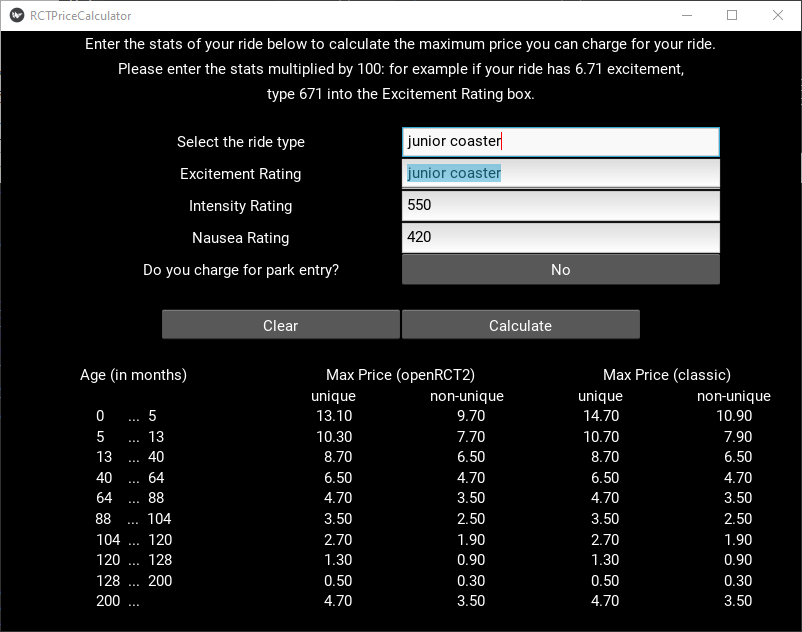

# Ride Price Calculator for OpenRCT2

Yes, this already exists at <https://rct2calc.shottysteve.com/> and probably other places. But I wanted to create my own version just because.

The calculator uses kivy for its GUI. More detailed list of dependencies can be found in *requirements.txt*.

This app offers the possibility to save excitement-intensity-nausea ratings to a database. The app then uses these saved ratings to set default values for the ratings. Currently the default is just the arithmetic mean of saved ratings.

To launch the calculator, type

`python main.py`

### Some notes

* Currently the database has at least one set of ratings for each ride. These ratings I have put in based on my saves.

* Database updates the default (average) ratings whenever a new set of ratings is saved to the database.

### Things to maybe add

* Emphasizing the first three lines in the pricetable, as they are the most important

* More things to manage the database better

* Making database functions less susceptible to errors

* Add missing rides (and aliases)

* Handling different modes for rides (Top Spin, Motion Simulator, etc)
