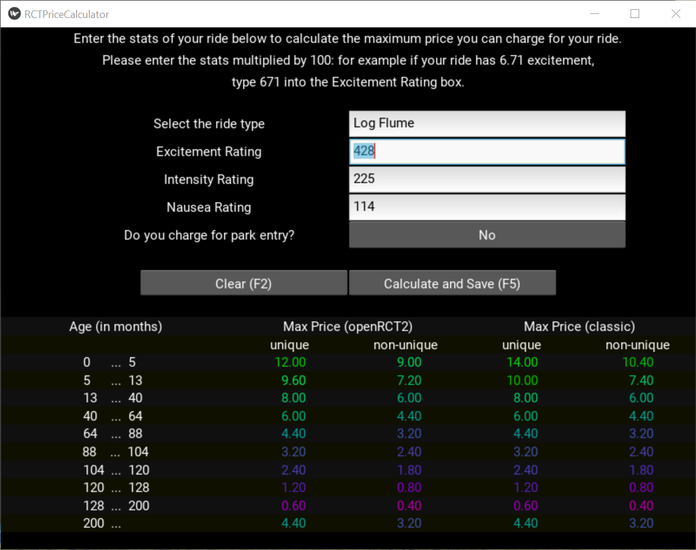

# Ride Price Calculator for OpenRCT2

Yes, this already exists at <https://rct2calc.shottysteve.com/> and probably other places. But I wanted to create my own version just because.

The calculator uses kivy for its GUI. More detailed list of dependencies can be found in *requirements.txt*.

This app uses sqlite database to store the ride data used for price calculations. This data was taken from the [openRCT2](https://github.com/OpenRCT2/OpenRCT2) source code. The database is also used to store excitement-intensity-nausea (EIN) ratings of rides. These ratings are then used to set default EIN ratings for rides.

To launch the calculator, type

`python main.py`

### Some features

* The app tries to match given (parts of) ride names to those in the database and gives suggestions to make sure a match is found.

* Currently the database has at least one set of ratings for almost every ride. Only Hybrid Coaster and Single Rail Roller Coaster do not have any ratings, since the ratings were taken from my games/saves.

* Database updates the default (average) ratings whenever a new set of ratings is saved to the database.

* If ride name is recognized and the rating input boxes are empty, the calculator fills them with default values.

* The prices are colored: the highest price (20€) is fully green, the lowest price (0) is fully red and everything else is somewhere between.

* By default, calculator takes as inputs EIN ratings multiplied by 100 (so that ratings are integers). However, calculator can handle actual (decimal) ratings as well, as long as it recognizes that they are decimal numbers.

### Things to maybe add

* Add more aliases and a better way to deal with them in name suggestions (i.e. only suggest one name for one ride)

* Emphasizing the first three lines in the pricetable, as they are the most important

* More things to manage the database better

* Making database functions less susceptible to errors

* Handling different modes for rides (Top Spin, Motion Simulator, etc)
